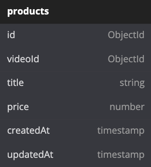

# Tokopedia Play Clone API

## Table of Contents

- [Database Schema](#database-schema)
- [API List](#api-list)
  - [Videos](#videos)
  - [Products](#products)
  - [Comments](#comments)
- [Swagger](#swagger)
- [License](#license)

## Database Schema

Database Schema for Tokopedia Play Clone

 


## API List

## Videos

Schema for videos

```
{
    id: ObjectId
    title: string
    imgUrl: string
    links: [
        video_detail: string
    ]
}
```

## GET /videos

Return all videos

- Query Params
  - search\
    required: false\
    example: http://localhost:3000/videos?search=gebyardiskon
- Headers\
  Content-Type: application/json
- Responses

##### ✅ 200 Success Get All Videos

```
{
  "status": true,
  "code": 200,
  "message": "Success Get All Videos",
  "data": [
    {
      "id": "VideoID01",
      "title": "Diskon Peripheral Gaming",
      "imgUrl": "https://localhost:3000/images/diskon-peripheral-gaming.jpg",
      "links": [
        {
          "video_detail": "https://localhost:3000/api/videos/asodiuhjas890u123"
        }
      ]
    }
  ]
}
```

##### ❌ 404 Data Not Found

```
{
  "status": false,
  "code": 404,
  "message": "Data Not Found",
  "data": [],
  "errors": []
}
```

##### ❌ 500 Internal Server Error

```
{
  "status": false,
  "code": 500,
  "message": "Internal Server Error",
  "data": [],
  "errors": []
}
```

## Products

Schema for Products

```
{
    id: ObjectId
    video_id: ObjectId
    title: string
    imgUrl: string
    price: number
    price_format: string
    links: [
        product_detail: string
    ]
}
```

## GET /products/{videoID}

Return all products

- Path Params
  - videoID\
    required: true\
    example: http://localhost:3000/videos/videoID01
- Headers\
  Content-Type: application/json
- Responses

##### ✅ 200 Success Get All Products

```
{
  "status": true,
  "code": 200,
  "message": "Success Get All Products",
  "data": [
    {
      "id": "ProductID01",
      "video_id": "VideoID01",
      "title": "Mouse Gaming Murah",
      "imgUrl": "https://localhost:3000/images/mouse-gaming-murah.jpg",
      "price": 20000,
      "price_format": "Rp. 20.000",
      "links": [
        {
          "product_detail": "https://localhost:3000/api/videos/asodiuhjas890u123"
        }
      ]
    }
  ]
}
```

##### ❌ 404 Data Not Found

```
{
  "status": false,
  "code": 404,
  "message": "Data Not Found",
  "data": [],
  "errors": []
}
```

##### ❌ 500 Internal Server Error

```
{
  "status": false,
  "code": 500,
  "message": "Internal Server Error",
  "data": [],
  "errors": []
}
```

## Comments

Schema for Comments

```
{
    id: ObjectId
    video_id: ObjectId
    username: string
    message: string
    timestamp: string
}
```

## GET /comments/{videoID}

Return all products

- Path Params
  - videoID\
    required: true\
    example: http://localhost:3000/videos/videoID01
- Headers\
  Content-Type: application/json
- Responses

##### ✅ 200 Success Get All Comments

```
{
  "status": true,
  "code": 200,
  "message": "Success Get All Comments",
  "data": [
    {
      "id": "CommentID01",
      "video_id": "VideoID01",
      "username": "MRaehanR",
      "text": "Murah Banget Kak!",
      "timestamp": "1 jam lalu"
    }
  ]
}
```

##### ❌ 404 Data Not Found

```
{
  "status": false,
  "code": 404,
  "message": "Data Not Found",
  "data": [],
  "errors": []
}
```

##### ❌ 500 Internal Server Error

```
{
  "status": false,
  "code": 500,
  "message": "Internal Server Error",
  "data": [],
  "errors": []
}
```

## POST /comments/{videoID}

Return all products

- Path Params
  - videoID\
    required: true\
    example: http://localhost:3000/videos/videoID01
- Headers\
  Content-Type: application/json
- Request Body

```
{
    "text": "Mouse nomor 1 kak!"
}
```

- Responses

##### ✅ 200 Success Get All Comments

```
{
  "status": true,
  "code": 200,
  "message": "Success Get All Comments",
  "data": [
    {
      "id": "CommentID01",
      "video_id": "VideoID01",
      "username": "MRaehanR",
      "message": "Murah Banget Kak!",
      "timestamp": "1 jam lalu"
    }
  ]
}
```

##### ❌ 400 Failed to Post Comment

```
{
  "status": false,
  "code": 400,
  "message": "Failed to Post Comment",
  "data": [],
  "errors": []
}
```

##### ❌ 500 Internal Server Error

```
{
  "status": false,
  "code": 500,
  "message": "Internal Server Error",
  "data": [],
  "errors": []
}
```

## Swagger

Default Swagger documentation api at [localhost:3000/docs/api](http://localhost:3000/docs/api)

## License

[MIT LICENSE](./LICENSE)
